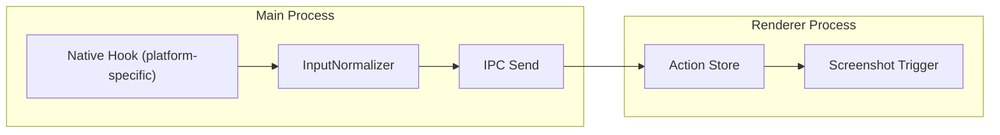

# Global Input Capture Implementation

## Overview

Add system-wide input capture in the main process using a native hook module:

- macOS: `iohook-macos`

Raw events are normalized into Action objects and forwarded to the renderer for screenshot coordination.



## 1. Install Dependencies

```bash
# macOS
npm install iohook-macos

# Required for Electron: rebuild the native module against your Electron version
npm run rebuild
```

If the app still says it can’t find `iohook-macos`, force a clean rebuild of Forge’s webpack output:

```bash
rm -rf .webpack
npm start
```

Note: On macOS, Accessibility permission is required. The app will prompt the user.

Supported: Electron 29-39 (excluding 32), Node 20-24.

## 2. Create Input Service Module

Create `src/main/inputService.ts`:

```typescript
import iohook, { type EventData, type AccessibilityPermissionsResult } from "iohook-macos";

// Types for normalized actions
type ActionType = "click" | "scroll_start" | "scroll_end" | "keypress";

type Action = {
  actionId: string;
  type: ActionType;
  happenedAt: number;
  coords: { x: number; y: number };
  // ... other fields from Design.md
};

// iohook API:
// const permissions: AccessibilityPermissionsResult = iohook.checkAccessibilityPermissions()
// if (!permissions.hasPermissions) iohook.requestAccessibilityPermissions()
//
// iohook.on("leftMouseDown", (event: EventData) => { /* event.x, event.y */ });
// iohook.on("keyDown", (event: EventData) => { /* event.keyCode, event.modifiers */ });
// iohook.on("scrollWheel", (event: EventData) => { /* event.x, event.y */ });
//
// iohook.startMonitoring(); // Start listening
// iohook.stopMonitoring();  // Stop listening
```

Key responsibilities:

- Start/stop global hooks on recording start/stop
- Normalize raw `leftMouseDown/rightMouseDown/otherMouseDown`, `keyDown`, `scrollWheel` events into Actions
- Debounce scroll events into `scroll_start` / `scroll_end`
- Generate unique `actionId` for each action
- Calculate `relativeTimeMs` from session start

## 3. Wire Up in Main Process

Update `src/index.ts`:

```typescript
import { InputService } from "./main/inputService";

// IPC handlers
ipcMain.handle("startInputCapture", (event, sessionStartTime) => {
  inputService.start(sessionStartTime, (action) => {
    // Forward action to renderer
    mainWindow.webContents.send("action", action);
  });
});

ipcMain.handle("stopInputCapture", () => {
  inputService.stop();
});
```

## 4. Update Preload for IPC

Update `src/preload.ts` to expose action listener:

```typescript
contextBridge.exposeInMainWorld("electronAPI", {
  onAction: (callback) =>
    ipcRenderer.on("action", (_, action) => callback(action)),
  startInputCapture: (sessionStartTime) =>
    ipcRenderer.invoke("startInputCapture", sessionStartTime),
  stopInputCapture: () => ipcRenderer.invoke("stopInputCapture"),
});
```

Note: This requires enabling `contextIsolation: true` (currently false). We can either:

- Enable it now (recommended for security)
- Keep using direct `ipcRenderer` access temporarily

## 5. Create useActions Hook in Renderer

Create `src/hooks/useActions.ts`:

```typescript
// Listen for actions from main process
// Store actions in state
// Trigger screenshot capture (future integration)
```

## 6. Integrate with Recording Flow

Update `useRecorder.ts` to:

- Call `startInputCapture` when recording starts
- Call `stopInputCapture` when recording stops
- Pass session start timestamp for `relativeTimeMs` calculation

## Files to Create/Modify

| File | Action |

|------|--------|

| `src/main/inputService.ts` | Create - Core input capture logic |

| `src/main/types.ts` | Create - Shared type definitions |

| `src/index.ts` | Modify - Add IPC handlers, wire input service |

| `src/preload.ts` | Modify - Expose action IPC |

| `src/hooks/useActions.ts` | Create - Renderer-side action handling |

| `src/hooks/useRecorder.ts` | Modify - Integrate input capture with recording |

| `package.json` | Modify - Add optional native hook deps |

## macOS Permission Handling

Use `iohook-macos` permission helpers in the main process (`checkAccessibilityPermissions()` / `requestAccessibilityPermissions()`).

## Event Normalization Details

| Raw Event | Action Type | Notes |

|-----------|-------------|-------|

| `leftMouseDown/rightMouseDown/otherMouseDown` | `click` | Map to button + coords |

| `keyDown` | `keypress` | Include keyCode + modifiers |

| `scrollWheel` | `scroll_start` | Debounce; emit `scroll_end` after 150ms idle |

| `mouseMoved` | `mouseover_start` | Emit on first move, include coords |

| `mouseMoved` | `mouseover_end` | Debounce; emit after 350ms idle (suppressed while dragging) |

| `leftMouseDragged` | `drag_start` | Emit once per drag (left button) |

| `leftMouseUp` | `drag_end` | Emit if a drag was active |

Note: While dragging, `mouseMoved` events are ignored so `mouseover_*` actions don’t overlap `drag_*`.

## macOS Native Hook Notes

- `iohook-macos` is a macOS-only native module; installs require Xcode Command Line Tools.
